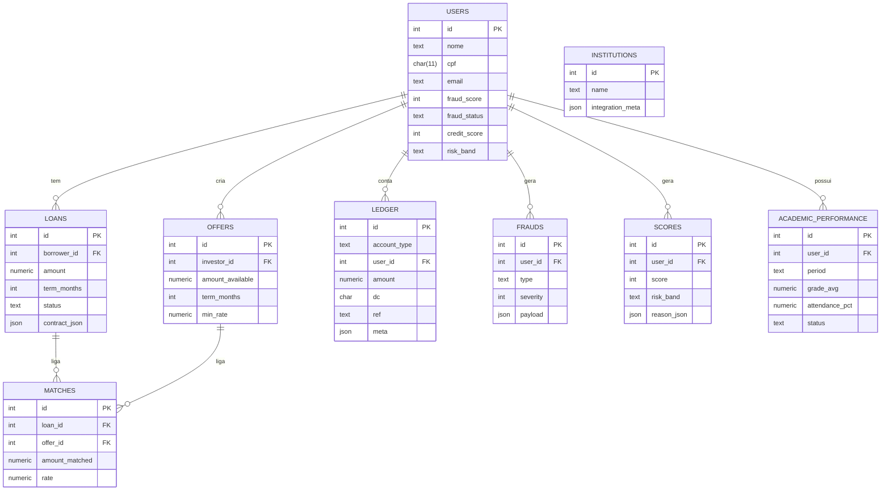

# Modelagem de Banco de Dados (Hackathon QI Tech)

## 1. Decisões de Design

- **Minimalismo:** reduzimos o número de tabelas para simplificar o MVP e acelerar o desenvolvimento.
- **Snapshots em `users`:** armazenamos score de crédito e status antifraude mais recentes no próprio usuário para consultas rápidas.
- **Histórico separado:** detalhes ficam em tabelas próprias (`frauds`, `scores`, `academic_performance`) garantindo rastreabilidade e auditoria.
- **Ledger de dupla entrada:** toda movimentação financeira (empréstimos, pagamentos, repasses) passa pelo ledger, garantindo consistência contábil.
- **Uso de JSONB:** colunas JSON permitem armazenar informações flexíveis (contratos, payloads de antifraude, metadados), sem precisar criar dezenas de tabelas auxiliares.
- **Flexibilidade e prototipagem rápida:** ideal para MVP e hackathons.

---

## 2. Vantagens da Estrutura

- **Simplicidade para prototipagem** e rápida evolução do MVP.
- **Didática e clareza** para mentores e jurados entenderem.
- **Escalabilidade:** cada módulo pode ser transformado em microserviço ou tabela especializada no futuro.
- **Transparência:** ledger garante rastreabilidade financeira.
- **Desacoplamento:** separação clara entre usuários, empréstimos, ofertas, fraudes, scores e movimentações.
- **Auditoria:** histórico append-only em `frauds`, `scores` e `ledger`.

---

## 3. Migrations e Seeds

### Migrations

- **Função:** versionar e criar/alterar tabelas do banco de forma reproduzível.
- **Ferramenta usada:** [Knex.js](https://knexjs.org/), permitindo definir migrations em JavaScript.
- **Fluxo de uso:**
  1. Criar migration: `npx knex migrate:make create_users_table`
  2. Rodar todas as migrations: `npx knex migrate:latest --knexfile knexfile.js`
  3. Cada migration cria ou altera tabelas com controle de versão (coluna `id` autoincrement, constraints, foreign keys).

### Seeds

- **Função:** popular o banco com dados iniciais para testes e demos.
- **Exemplo:** tabela `users`, `offers` e `loans` recebem registros iniciais de teste.
- **Comando:** `npx knex seed:run --knexfile knexfile.js`
- **Benefício:** garante que qualquer desenvolvedor ou ambiente consiga reproduzir dados de teste consistentes.

> Observação: migrations + seeds permitem que o banco seja reconstruído do zero rapidamente, essencial em hackathons e deploys em ambientes diferentes (local, staging, render).

---

## 4. Modelagem do Banco de Dados

| Tabela                   | Principais Campos                                                        | Descrição                                                        |
| ------------------------ | ------------------------------------------------------------------------ | ---------------------------------------------------------------- |
| **users**                | id, nome, cpf, email, fraud_score, fraud_status, credit_score, risk_band | Dados cadastrais + snapshots de antifraude e score de crédito    |
| **loans**                | id, borrower_id, amount, term_months, status, contract_json              | Pedidos de empréstimo do tomador                                 |
| **offers**               | id, investor_id, amount_available, term_months, min_rate                 | Ofertas de investimento dos investidores                         |
| **matches**              | id, loan_id, offer_id, amount_matched, rate                              | Relacionamento entre pedidos e ofertas (fracionamento permitido) |
| **ledger**               | id, account_type, user_id, amount, dc, ref, meta                         | Lançamentos de dupla entrada para saldos e pagamentos            |
| **frauds**               | id, user_id, type, severity, payload                                     | Histórico de sinais antifraude                                   |
| **scores**               | id, user_id, score, risk_band, reason_json                               | Histórico de cálculos de score de crédito                        |
| **academic_performance** | id, user_id, period, grade_avg, attendance_pct, status                   | Histórico acadêmico para cálculo de score                        |
| **institutions**         | id, name, integration_meta                                               | Informações de instituições de ensino                            |

---

## 5. Fluxo dos Dados

1. **Cadastro/Onboarding:** cria usuário em `users`. OTPs e verificações KYC podem gerar registros em `frauds`.
2. **Antifraude:** cada sinal é salvo em `frauds`; snapshot em `users` atualizado (`fraud_score`, `fraud_status`).
3. **Score de Crédito:** cada cálculo é salvo em `scores`; snapshot em `users` atualizado (`credit_score`, `risk_band`).
4. **Empréstimos (`loans`):** tomadores registram pedidos de empréstimo.
5. **Ofertas (`offers`):** investidores registram ofertas de investimento.
6. **Matching:** pedidos e ofertas são casados, registrados em `matches`.
7. **Ledger:** toda liberação, pagamento e repasse é registrado em dupla entrada (`ledger`).
8. **Saldos:** consultados via `VIEW balances` ou funções agregadas.

---

Usuário (borrower)  
│  
▼  
Cadastro / Onboarding

- Tabela: `users`
- Inserção de dados básicos
- Verificação KYC  
  │  
  ▼  
  Antifraude Automático
- Tabela: `frauds`
- Atualiza snapshot em `users` (`fraud_score`, `fraud_status`)  
  │  
  ▼  
  Score de Crédito
- Tabela: `scores`
- Atualiza snapshot em `users` (`credit_score`, `risk_band`)  
  │  
  ▼  
  Empréstimo (`loans`)
- Usuário cria pedido  
  │  
  ▼  
  Matching Automático
- Tabelas: `offers`, `matches`
- Função: `match_loan()` conecta empréstimos a ofertas  
  │  
  ▼  
  Contrato Digital
- JSON em `contract_json` de `loans`  
  │  
  ▼  
  Liberação de Recursos
- Função: `ledger_transfer()`
- Tabela: `ledger` (débito/crédito)  
  │  
  ▼  
  Saldo Atualizado
- View: `balances`

---

## 6. Diagrama Entidade-Relacionamento (ERD)

## 7. Tecnologias e justificativa

### Banco de Dados: PostgreSQL (Render)

- **Por que:** ACID, robusto, suporte a JSONB, views, funções e locks por linha.
- **Benefício:** prototipagem rápida de regras complexas (ledger, matching, triggers) sem infra pesada.
- **Trade-off:** NoSQL não garante consistência contábil necessária para o ledger.

### JSONB (`contract_json`, `payload`, `meta`)

- **Flexível:** contratos, antifraude e metadados sem tabelas extras.
- **Rápido para MVP:** mudanças de schema não quebram banco.
- **Trade-off:** validação de dados na aplicação necessária.

### Funções PL/pgSQL (`ledger_transfer`, `match_loan`)

- Regras críticas encapsuladas no banco, garantindo atomicidade e evitando condições de corrida.
- **Benefício:** segurança mesmo com concorrência e lógica persistente no banco.

### Triggers e snapshots em `users`

- Mantêm snapshots consistentes com histórico.
- **Benefício:** consultas e decisões em tempo real.
- **Trade-off:** aumenta complexidade de debugging, mas ideal para MVP com auditoria.

### Ledger de dupla entrada

- **Por que:** consistência financeira e rastreabilidade.
- **Benefício:** auditoria e reconciliação simplificadas.

### View `balances`

- Consulta de saldo por usuário isolando lógica contábil da aplicação.

### Ferramentas auxiliares

- **Render:** deploy rápido do PostgreSQL.
- **DBeaver:** gerenciamento visual do banco.
- **Knex.js:** migrations e seeds para versão e populamento do banco.
- **GitHub Actions:** CI para migrations e seeds automáticas.
- **.env + Secrets:** variáveis seguras.

### Segurança e conformidade

- Conexão TLS/SSL entre app e DB.
- Hash de senhas (bcrypt/argon2).
- Sanitização e validação de inputs (SQLi/XSS).
- Histórico append-only (`frauds`, `scores`, `ledger`).

### Cobertura dos requisitos do hackathon

- **Carteira / P2P:** `offers`, `loans`, `matches`, `ledger`.
- **Antifraude:** `frauds` + triggers bloqueiam usuários suspeitos.
- **Score dinâmico:** `scores` + snapshot `users.credit_score`.
- **Contrato digital e liberação:** `contract_json` + `ledger_transfer`.
- **Reprodutibilidade:** migrations + seeds permitem reconstruir banco do zero em qualquer ambiente.
