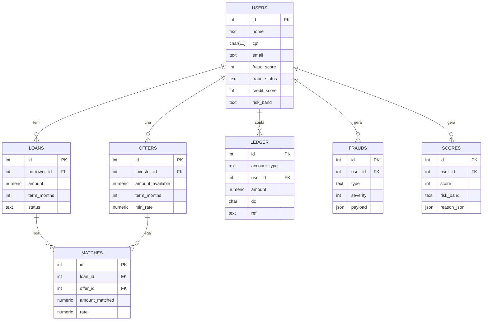

# Modelagem de Banco de Dados (Hackathon QI Tech)

## 1. Decisões de Design

- **Minimalismo:** reduzimos o número de tabelas para simplificar o MVP e acelerar o desenvolvimento.
- **Snapshots em `users`:** guardamos o score e status antifraude mais recentes no próprio usuário,
  para consultas rápidas.
- **Histórico separado:** detalhes ficam em tabelas próprias (`frauds` e `scores`), garantindo
  rastreabilidade e auditoria.
- **Ledger de dupla entrada:** toda movimentação financeira (empréstimos, pagamentos, repasses) passa pelo
  ledger, garantindo consistência contábil e rastreabilidade.
- **Uso de JSONs:** colunas JSON permitem armazenar informações flexíveis (contratos, parcelas, payloads de fraude),
  sem precisar criar dezenas de tabelas auxiliares.

---

## 2. Vantagens da Estrutura

- **Simplicidade para prototipagem** em um hackathon.
- **Didática e clareza** para jurados e mentores entenderem.
- **Escalabilidade:** cada módulo pode virar microserviço ou tabela especializada futuramente.
- **Transparência:** o ledger garante rastreabilidade financeira.
- **Flexibilidade:** uso de JSON evita rigidez prematura.
- **Desacoplamento:** separação clara entre dados de usuários, pedidos/ofertas e eventos (fraudes/scores).

---

## 3. Modelagem do Banco de Dados

| Tabela      | Principais Campos                                       | Descrição                                                     |
| ----------- | ------------------------------------------------------- | ------------------------------------------------------------- |
| **users**   | nome, cpf, email, fraud_score, credit_score             | Dados cadastrais + snapshots de antifraude e score de crédito |
| **loans**   | borrower_id, amount, term_months, status, contract_json | Pedidos de empréstimo do tomador                              |
| **offers**  | investor_id, amount_available, term_months, min_rate    | Ofertas de investimento dos investidores                      |
| **matches** | loan_id, offer_id, amount_matched, rate                 | Relação entre pedidos e ofertas (fracionamento permitido)     |
| **ledger**  | account_type, user_id, amount, dc, ref, meta            | Lançamentos de dupla entrada para saldos e pagamentos         |
| **frauds**  | user_id, type, severity, payload                        | Histórico de sinais antifraude                                |
| **scores**  | user_id, score, risk_band, reason_json                  | Histórico de cálculos de score de crédito                     |

---

## 4. Fluxo dos Dados

1. **Cadastro/Onboarding:** cria usuário em `users`. OTPs e verificações KYC podem gerar registros em `frauds`.
2. **Antifraude:** cada sinal é salvo em `frauds`; o snapshot em `users` é atualizado com `fraud_score` e `fraud_status`.
3. **Score de Crédito:** cada cálculo é salvo em `scores`; o snapshot em `users` é atualizado com `credit_score` e `risk_band`.
4. **Empréstimos (loans):** tomadores registram pedidos.
5. **Ofertas (offers):** investidores registram ofertas.
6. **Matching:** os pedidos são casados com ofertas, registrados em `matches`.
7. **Ledger:** toda liberação, pagamento e repasse é registrado em dupla entrada.
8. **Saldos:** são consultados via `VIEW balances`.

---

Usuário (borrower)
│
▼
Cadastro / Onboarding

- Tabela: users
- Inserção de dados básicos
- Verificação KYC
  │
  ▼
  Antifraude Automático
- Tabela: frauds
- Função: atualiza snapshot em users (fraud_score, fraud_status)
  │
  ▼
  Score de Crédito
- Tabela: scores
- Função: atualiza snapshot em users (credit_score, risk_band)
  │
  ▼
  Empréstimo (Loan)
- Tabela: loans
- Usuário cria pedido
  │
  ▼
  Matching Automático
- Tabela: offers / matches
- Função: match_loan()
- Conecta empréstimos a ofertas de investidores
  │
  ▼
  Contrato Digital
- JSON no campo contract_json de loans
  │
  ▼
  Liberação de Recursos
- Função: ledger_transfer()
- Tabela: ledger (débito/crédito)
  │
  ▼
  Saldo Atualizado
- View: balances
- Consulta saldo após liberação/pagamento

## 5. Diagrama Entidade-Relacionamento (ERD)

## 6. Tecnologias escolhidas — justificativa

Nesta seção explicamos por que adotamos cada tecnologia e padrão arquitetural no MVP.

### Banco de dados: PostgreSQL (hosted no Render)

- **Por que:** PostgreSQL é ACID, maduro, oferece boa performance e recursos avançados (JSONB, views, funções PL/pgSQL, locks por linha) que usamos para garantir consistência e auditoria.
- **Benefício para o hackathon:** permite prototipar regras de negócio complexas (ledger, matching, triggers) sem depender de infra pesada; o plano gratuito do Render agiliza o deploy e facilita demo.
- **Trade-off:** não usamos bancos NoSQL para tudo porque precisamos de garantias fortes de consistência contábil (dupla entrada).

### Colunas JSONB (contract_json, payload, meta)

- **Por que:** flexibilidade para armazenar contratos, payloads de antifraude e metadados sem criar dezenas de tabelas auxiliares.
- **Benefício:** acelera iteração no MVP (mudanças de campos do contrato não quebram schema) e é eficiente para consultas parciais quando necessário (JSONB).
- **Trade-off:** dados semi-estruturados exigem validação na aplicação para garantir qualidade.

### Funções PL/pgSQL (ledger_transfer, match_loan)

- **Por que:** encapsular regras críticas (transferência contábil atômica, matching FIFO) no banco garante atomicidade, evita condições de corrida e facilita auditoria.
- **Benefício:** operações atômicas seguras mesmo com concorrência; lógica persiste junto com os dados, facilitando rollback e testes.

### Triggers e snapshots em `users`

- **Por que:** triggers mantêm o snapshot (fraud_score, credit_score) consistente com o histórico (frauds, scores) automaticamente.
- **Benefício:** consultas rápidas e decisões em tempo real (ex.: bloquear onboarding) sem recalcular historicamente a cada request.
- **Trade-off:** triggers aumentam complexidade de debugging; contudo, para um MVP com requisitos de auditoria/speed, o ganho compensa.

### View `balances`

- **Por que:** view sintetiza o saldo por usuário a partir do ledger de dupla entrada.
- **Benefício:** isolamento da lógica contábil do consumo pela aplicação ou dashboard, garantindo transparência.

### Ledger de dupla entrada (modelo contábil)

- **Por que:** padrão contábil que garante consistência financeira e rastreabilidade (débito/credito para todo evento financeiro).
- **Benefício:** facilita auditoria e reconciliação, ponto muito valorizado em soluções financeiras.

### Ferramentas de desenvolvimento / operações

- **Render (host):** deploy rápido do banco PostgreSQL (plano free), adequado para demo e hackathon.
- **DBeaver (cliente):** gerenciamento visual do DB, inspeção de dados e execução de scripts durante a demo.
- **GitHub Actions:** CI para aplicar migrations e seeds automaticamente (reprodutibilidade entre runs).
- **.env + Secrets:** segredos e URLs armazenados em variáveis/Secrets — evita vazamento de credenciais.

### Segurança e conformidade (práticas adotadas)

- **Conexões TLS/SSL:** usar TLS entre app e DB (configurar `sslmode=require`) para produção/demo segura.
- **Hash de senhas:** bcrypt/argon2 (aplicar no backend).
- **Sanitização e validação:** inputs validados no backend para evitar SQLi/XSS (principalmente porque usamos JSONB).
- **Auditoria:** histórico append-only (frauds, scores, ledger) garante rastreabilidade.

### Como isso responde ao edital (mapping rápido)

- **Carteira / P2P:** `offers`, `loans`, `matches` e `ledger` cobrem fluxo completo de investimento e repasse.
- **Antifraude:** `frauds` + triggers permitem sinalizar/ bloquear usuários automaticamente.
- **Score dinâmico:** `scores` + snapshot `users.credit_score` permitem decisões em tempo real.
- **Contrato digital e liberação:** `contract_json` em `loans` + `ledger_transfer` suportam geração e execução do contrato e liberação rápida.
