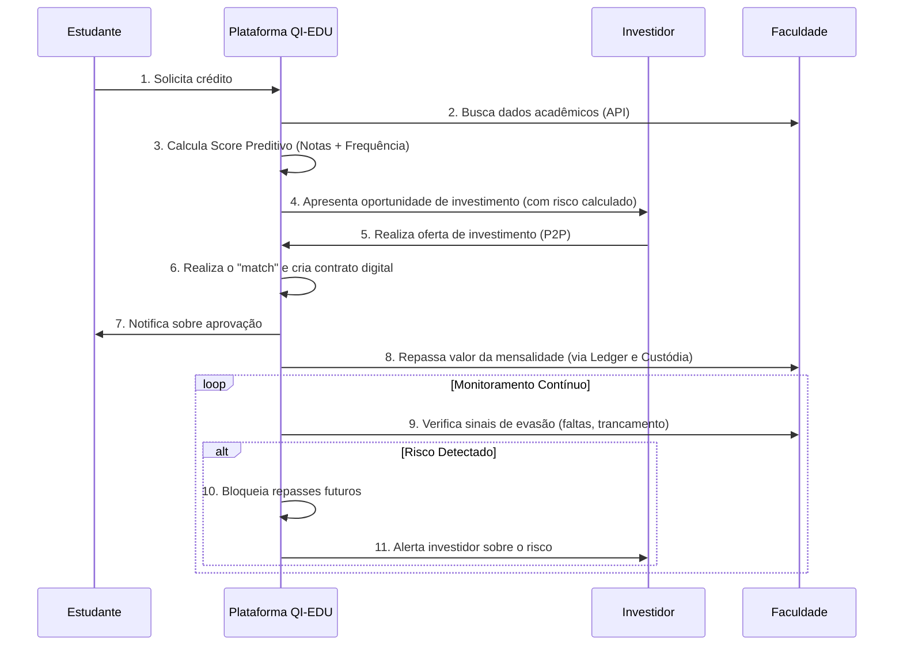

# Arquitetura e Fluxo de Valor da Solução

A arquitetura da plataforma QI-EDU foi projetada para ser **modular, escalável e segura**, equilibrando simplicidade para o MVP do hackathon e robustez para evolução futura. A escolha por uma arquitetura em camadas desacopladas permite desenvolvimento ágil, prototipação rápida e clareza na apresentação da solução.  

---

## 1. Diagrama de Arquitetura do Sistema

O diagrama abaixo ilustra a **macroarquitetura** do sistema, dividida em seis camadas principais.

<p style={{textAlign: 'center'}}></p>
<div style={{margin: 25}}>
    <div style={{textAlign: 'center'}}>
        
        <br />
    </div>
</div>
<p style={{textAlign: 'center'}}>Fonte: Os autores (2025)</p>

---

## 2. Diagrama de Fluxo de Valor (Jornada do Usuário)

Enquanto o diagrama de arquitetura mostra *como* o sistema é construído, o diagrama de sequência abaixo mostra *o que* ele faz, contando a história da perspectiva do usuário e destacando os diferenciais da solução.



---

## 3. Escopo do MVP: O que será "Mockado" (Simulado)

Para garantir a entrega de um protótipo funcional e focado nos diferenciais da solução durante o hackathon, alguns componentes serão implementados de forma real, enquanto outros serão simulados.

### Implementado no MVP
- **Fluxo CRUD real** de usuários, empréstimos, ofertas e matches.  
- **Banco relacional (PostgreSQL)** com migrations e seeds.  
- **Score inicial** (regra simples: ex. média ≥ 7 e presença ≥ 75%).  
- **Matching P2P** (algoritmo básico de pareamento).  
- **Ledger de dupla entrada** simulado no Postgres.  
- **Frontend básico** (painel do estudante, investidor e faculdade).  

### Mockado no MVP
- **Integração com Faculdades:** dados acadêmicos simulados via seeds no banco.  
- **Integração com Pagamentos (QI Tech/PIX/boletos):** função que grava no ledger “pagamento realizado”.  
- **Módulo Antifraude:** gatilhos manuais (ex. botão “Aluno trancou matrícula”).  
- **Notificações (E-mail/SMS):** logs no console ou envio para “fake inbox”.  
- **Redis:** apenas cache de sessão, filas simuladas com chamadas diretas.  
- **S3/Storage:** não implementado; contratos guardados em JSONB no Postgres.  

---

## 4. Estrutura de Banco de Dados (Planejada)

O banco de dados relacional escolhido é o **PostgreSQL**, por garantir consistência transacional (ACID), rastreabilidade (ledger de dupla entrada) e flexibilidade (uso de JSONB).  

### Principais Entidades
- **Users**: Estudantes, Investidores e Faculdades.  
- **Loans**: Pedidos de empréstimo.  
- **Offers**: Ofertas de investimento.  
- **Matches**: Conexão entre loans e offers (P2P).  
- **Ledger**: Lançamentos de dupla entrada.  
- **Scores**: Histórico de scores de crédito.  
- **Frauds**: Sinais de risco.  
- **Academic_Performance**: Histórico acadêmico.  
- **Institutions**: Faculdades integradas.  

> O DER já está definido e será implementado no Postgres com migrations e seeds via Knex.js.  

---

## 5. Detalhamento das Camadas da Arquitetura

### 5.1. Camada de Frontend (Apresentação)

- **Tecnologia:** React/Next.js  
- **Componentes:** Painel do Estudante, Painel do Investidor, Painel da Faculdade.  
- **Justificativa:** Produtividade, performance e ecossistema robusto para acelerar a construção de interfaces.  
- **Explicação:** Essa camada é o **rosto da solução**, onde os usuários interagem. Fornece interfaces adaptadas a cada perfil (estudante, investidor, faculdade).  

**Estrutura de Pastas (proposta):**
```
/frontend
 ├── src/
 │   ├── pages/
 │   │   ├── estudante/
 │   │   ├── investidor/
 │   │   └── faculdade/
 │   ├── components/
 │   ├── services/
 │   ├── context/
 │   ├── hooks/
 │   └── utils/
 └── public/
```

---

### 5.2. Camada de API/Backend (Gateway + Core de Negócio)

- **Tecnologia:** Node.js (Express)  
- **Componentes:** API REST, Autenticação (JWT), Rate Limiting, Logging.  
- **Justificativa:** Linguagem unificada com o frontend e alta performance.  
- **Explicação:** Essa camada é o **cérebro da plataforma**, recebendo requisições do frontend, aplicando autenticação e repassando para o core de negócio.  

**Principais módulos planejados:**
- **Onboarding/KYC:** cadastro de usuários com verificação básica.  
- **Score Engine:** calcula risco do aluno com base em notas e frequência.  
- **Matching P2P:** conecta ofertas de investidores a pedidos de crédito.  
- **Ledger (Dupla Entrada):** registra cada transação com débito e crédito.  
- **Antifraude Comportamental:** detecta sinais de evasão e bloqueia repasses.  
- **Liquidação:** gerencia o repasse da mensalidade à faculdade.  

**Estrutura de Pastas (proposta):**
```
/backend
 ├── src/
 │   ├── modules/ (users, loans, offers, scores, ledger...)
 │   ├── workers/ (matchingJob, scoreJob, antifraudJob, notificationsJob)
 │   ├── middlewares/ (auth, logging, errorHandler)
 │   ├── routes/
 │   └── config/ (db, redis, env)
 └── knexfile.js
```

---

### 5.3. Camada de Persistência (Dados)

- **Tecnologias:** PostgreSQL, Redis, S3/Storage  
- **Componentes:** Banco de dados principal, cache/fila e armazenamento de objetos.  
- **Justificativa:** Confiabilidade transacional (Postgres) + performance para tarefas assíncronas (Redis).  
- **Explicação:** Essa camada é a **memória da plataforma**, garantindo persistência de dados e rapidez de acesso.  

---

### 5.4. Workers Assíncronos (Background Jobs)

- **Componentes:** Job Score, Job Matching, Job Antifraude, Job Notificações.  
- **Justificativa:** Mantêm a plataforma responsiva, delegando tarefas pesadas para segundo plano.  
- **Explicação:** Essa camada é o **braço operacional**, processando rotinas em background (ex: reavaliação de risco).  

---

### 5.5. Integrações Externas

- **Componentes:** APIs das Faculdades, Sistema de Notificação, Provedor de Pagamentos.  
- **Justificativa:** Foco no core business ao integrar com serviços especializados.  
- **Explicação:** Essa camada é o **elo com o mundo externo**, conectando QI-EDU a parceiros.  

---

## 6. Fluxo de Dados e Segurança (Planejado)

- Toda comunicação via **HTTPS/TLS**.  
- Autenticação com **JWT**.  
- Validação de inputs contra **SQL Injection/XSS**.  
- Logs de auditoria centralizados.  
- Dados sensíveis criptografados no banco.  

---

## 7. Escalabilidade e Futuro

- Evolução de monólito modular → microserviços.  
- Redis para filas reais e cache de alta performance.  
- Deploy containerizado (Docker/Kubernetes).  
- Balanceamento de carga e observabilidade (métricas + logging estruturado).  

---
