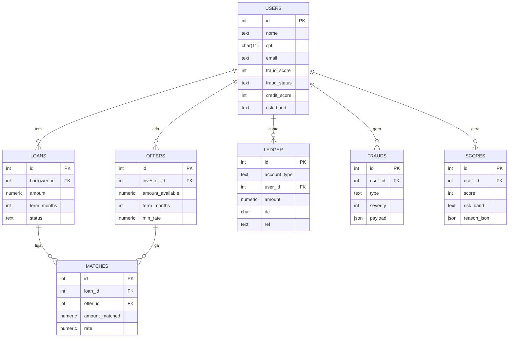

# Modelagem de Banco de Dados (Hackathon QI Tech)

## 1. Decisões de Design

- **Minimalismo:** reduzimos o número de tabelas para simplificar o MVP e acelerar o desenvolvimento.  
- **Snapshots em `users`:** guardamos o score e status antifraude mais recentes no próprio usuário, 
  para consultas rápidas.  
- **Histórico separado:** detalhes ficam em tabelas próprias (`frauds` e `scores`), garantindo 
  rastreabilidade e auditoria.  
- **Ledger de dupla entrada:** toda movimentação financeira (empréstimos, pagamentos, repasses) passa pelo 
  ledger, garantindo consistência contábil e rastreabilidade.  
- **Uso de JSONs:** colunas JSON permitem armazenar informações flexíveis (contratos, parcelas, payloads de fraude), 
  sem precisar criar dezenas de tabelas auxiliares.  

---

## 2. Vantagens da Estrutura

- **Simplicidade para prototipagem** em um hackathon.  
- **Didática e clareza** para jurados e mentores entenderem.  
- **Escalabilidade:** cada módulo pode virar microserviço ou tabela especializada futuramente.  
- **Transparência:** o ledger garante rastreabilidade financeira.  
- **Flexibilidade:** uso de JSON evita rigidez prematura.  
- **Desacoplamento:** separação clara entre dados de usuários, pedidos/ofertas e eventos (fraudes/scores).  

---

## 3. Modelagem do Banco de Dados

| Tabela   | Principais Campos | Descrição |
|----------|------------------|-----------|
| **users**   | nome, cpf, email, fraud_score, credit_score | Dados cadastrais + snapshots de antifraude e score de crédito |
| **loans**   | borrower_id, amount, term_months, status, contract_json | Pedidos de empréstimo do tomador |
| **offers**  | investor_id, amount_available, term_months, min_rate | Ofertas de investimento dos investidores |
| **matches** | loan_id, offer_id, amount_matched, rate | Relação entre pedidos e ofertas (fracionamento permitido) |
| **ledger**  | account_type, user_id, amount, dc, ref, meta | Lançamentos de dupla entrada para saldos e pagamentos |
| **frauds**  | user_id, type, severity, payload | Histórico de sinais antifraude |
| **scores**  | user_id, score, risk_band, reason_json | Histórico de cálculos de score de crédito |

---

## 4. Fluxo dos Dados

1. **Cadastro/Onboarding:** cria usuário em `users`. OTPs e verificações KYC podem gerar registros em `frauds`.  
2. **Antifraude:** cada sinal é salvo em `frauds`; o snapshot em `users` é atualizado com `fraud_score` e `fraud_status`.  
3. **Score de Crédito:** cada cálculo é salvo em `scores`; o snapshot em `users` é atualizado com `credit_score` e `risk_band`.  
4. **Empréstimos (loans):** tomadores registram pedidos.  
5. **Ofertas (offers):** investidores registram ofertas.  
6. **Matching:** os pedidos são casados com ofertas, registrados em `matches`.  
7. **Ledger:** toda liberação, pagamento e repasse é registrado em dupla entrada.  
8. **Saldos:** são consultados via `VIEW balances`.  

---

## 5. Diagrama Entidade-Relacionamento (ERD)

