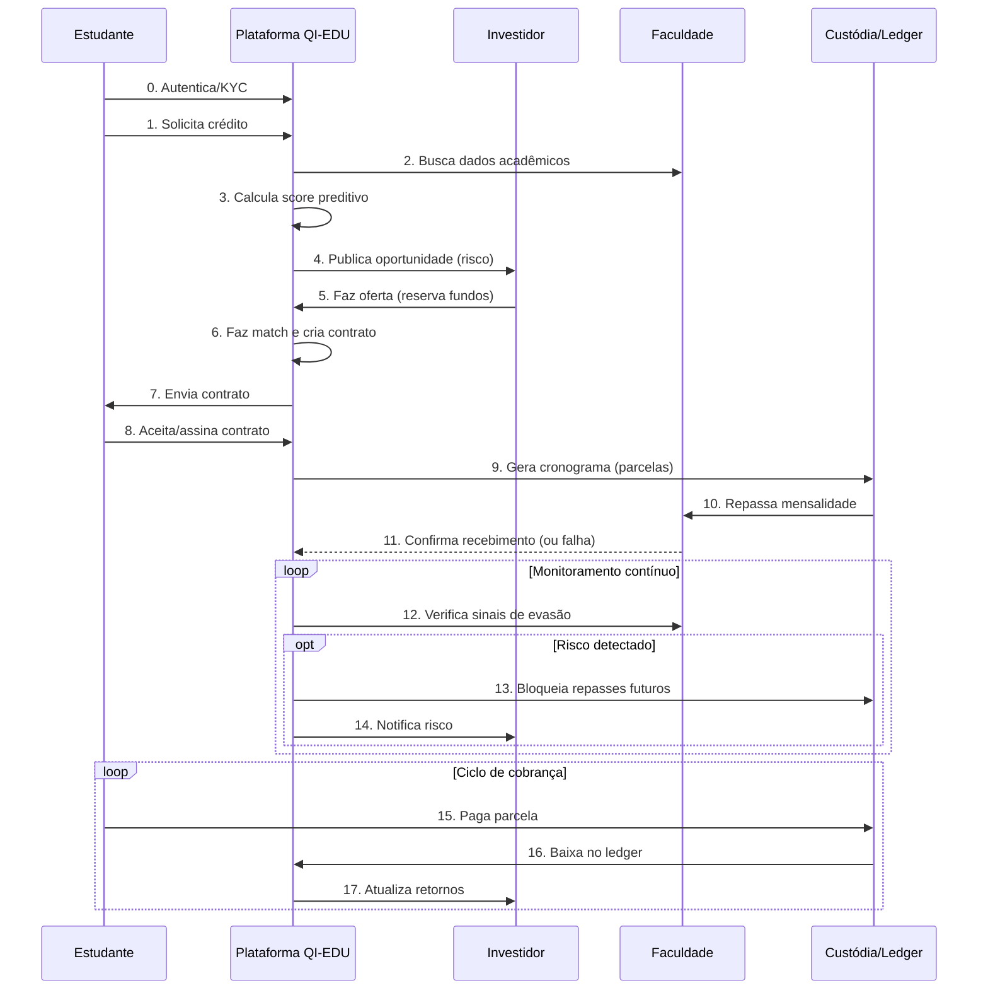

# Arquitetura e Fluxo de Valor da Solução

A arquitetura da plataforma QI-EDU foi projetada para ser **modular, escalável e segura**, equilibrando simplicidade para o MVP do hackathon e robustez para evolução futura. A escolha por uma arquitetura em camadas desacopladas permite desenvolvimento ágil, prototipação rápida e clareza na apresentação da solução.

---

## 1. Diagrama de Arquitetura do Sistema

O diagrama abaixo ilustra a **macroarquitetura** do sistema, dividida em seis camadas principais.

<p style={{textAlign: 'center'}}></p>
<div style={{margin: 25}}>
    <div style={{textAlign: 'center'}}>
        
        <br />
    </div>
</div>
<p style={{textAlign: 'center'}}>Fonte: Os autores (2025)</p>

---

## 2. Diagrama de Fluxo de Valor (Jornada do Usuário)

Enquanto o diagrama de arquitetura mostra _como_ o sistema é construído, o diagrama de sequência abaixo mostra _o que_ ele faz, contando a história da perspectiva do usuário e destacando os diferenciais da solução.



---

## 3. Escopo do MVP: O que será "Mockado" (Simulado)

Para garantir a entrega de um protótipo funcional e focado nos diferenciais da solução durante o hackathon, alguns componentes serão implementados de forma real, enquanto outros serão simulados.

### Implementado no MVP

- **Fluxo CRUD real** de usuários, empréstimos, ofertas e matches.
- **Banco relacional (PostgreSQL)** com migrations e seeds.
- **Score inicial** (regra simples: ex. média ≥ 7 e presença ≥ 75%).
- **Matching P2P** (algoritmo de pareamento).
- **Ledger de dupla entrada** simulado no Postgres.
- **Frontend básico** (fluxo do estudante e investidor).

### Mockado no MVP

- **Integração com Faculdades:** dados acadêmicos simulados via seeds no banco.
- **Integração com Pagamentos (QI Tech/PIX/boletos):** função que grava no ledger “pagamento realizado”.
- **Módulo Antifraude:** gatilhos manuais (ex. botão “Aluno trancou matrícula”).
- **S3/Storage:** não implementado; contratos guardados em JSONB no Postgres.

---

## 4. Detalhamento das Camadas da Arquitetura

### 4.1. Camada de Frontend (Apresentação)

- **Tecnologia:** React/Next.js (App Router)
- **Componentes:** Painel do Estudante, Painel do Investidor.
- **Justificativa:** Produtividade, performance e ecossistema robusto para acelerar a construção de interfaces.
  - App Router + Server Components reduzem JS no cliente e melhoram TTFB.
  - SSR/ISR para dashboards e páginas dinâmicas com dados do backend.
  - Integração direta com APIs REST (fetch/axios) do Node/Express.
  - DX rápida (hot reload, Tailwind) e deploy simples (Vercel/Node).
- **Explicação:** Essa camada é o **rosto da solução**, onde os usuários interagem. Fornece interfaces adaptadas a cada perfil (estudante e investidor).

**Estrutura de Pastas (proposta):**

```
/client
 ├── src/
 │   ├── app/
 │   │   ├── page.js
 │   │   ├── login/
 │   │   ├── cadastro/
 │   │   ├── dashboard/
 │   │   ├── para-estudantes/
 │   │   └── para-investidores/
 │   ├── components/
 │   └── services/
 ├── package.json
 └── next.config.mjs
```

---

### 4.2. Camada de API/Backend (Gateway + Core de Negócio)

- **Tecnologia:** Node.js (Express)
- **Componentes:** API REST, Autenticação (JWT), Rate Limiting, Logging.
- **Justificativa:** Linguagem unificada com o frontend e alta performance.
- **Explicação:** Essa camada é o **cérebro da plataforma**, recebendo requisições do frontend, aplicando autenticação e repassando para o core de negócio.

**Principais módulos planejados:**

- **Onboarding/KYC:** cadastro de usuários com verificação básica.
- **Score Engine:** calcula risco do aluno com base em notas e frequência.
- **Matching P2P:** conecta ofertas de investidores a pedidos de crédito.
- **Ledger (Dupla Entrada):** registra cada transação com débito e crédito.
- **Antifraude Comportamental:** detecta sinais de evasão e bloqueia repasses.
- **Liquidação:** gerencia o repasse da mensalidade à faculdade.

**Estrutura de Pastas (proposta):**

```
/server
 ├── src/
 │   ├── controllers/
 │   ├── routes/
 │   ├── middleware/
 │   ├── services/
 │   ├── utils/
 │   └── server.js
 ├── db/
 │   ├── migrations/
 │   └── seeds/
 ├── knexfile.js
 └── package.json
```

---

### 4.3. Camada de Persistência (Dados)

- **Tecnologias (atual):** PostgreSQL
- **Tecnologias (futuro):** Redis (cache/filas), S3/Storage (objetos)
- **Componentes:** Banco de dados relacional; futuramente cache/fila e armazenamento de objetos.
- **Justificativa:** Confiabilidade transacional (Postgres) hoje; expansão para cache/filas e storage quando necessário.
- **Explicação:** Essa camada é a **memória da plataforma**, garantindo persistência e base para auditoria (ledger).

---

### 4.4. Workers Assíncronos (Background Jobs)

- **Componentes:** Job Score, Job Matching, Job Antifraude, Job Notificações.
- **Justificativa:** Mantêm a plataforma responsiva, delegando tarefas pesadas para segundo plano.
- **Explicação:** Essa camada é o **braço operacional**, processando rotinas em background (ex: reavaliação de risco).

---

### 4.5. Integrações Externas

- **Componentes:** APIs das Faculdades, API de Pagamentos.
- **Justificativa:** Foco no core business ao integrar com serviços especializados.
- **Explicação:** Essa camada é o **elo com o mundo externo**, conectando QI-EDU a parceiros.

### 4.6. Motor de Score Preditivo (Análise do Aluno)

- **Objetivo:** avaliar o risco de crédito de forma mais justa, indo além das análises tradicionais (SPC/Serasa) e considerando o **desempenho acadêmico** do estudante.
- **Inputs Utilizados:**
  - **Acadêmicos:** média de notas, frequência, histórico de trancamentos.
  - **Financeiros:** histórico de pagamentos no ledger (se houver).
  - **Comportamentais:** alertas de fraude ou sinais de evasão (ex.: faltas excessivas).
- **Processamento no MVP:**
  - Regra simples (heurística):
    - Média ≥ 7 e frequência ≥ 75% → **baixo risco**.
    - Média entre 5 e 7 → **risco médio**.
    - Média < 5 ou frequência baixa → **alto risco**.
- **Processamento Futuro:**
  - Uso de modelos de Machine Learning supervisionados (ex.: regressão logística ou árvores de decisão) treinados com dados históricos de inadimplência.
  - Capacidade de reavaliar periodicamente o aluno conforme chegam novos dados acadêmicos.
- **Integração:**
  - Cada cálculo gera um registro na tabela `scores`.
  - Snapshot atualizado no usuário (`credit_score`, `risk_band`) para consultas rápidas.
  - Workers periódicos reexecutam a análise quando chegam novos dados acadêmicos.

**Explicação:** esse motor é o **diferencial competitivo** da QI-EDU, porque conecta performance acadêmica com risco financeiro, reduzindo inadimplência e democratizando o crédito para bons alunos.

---

## 5. Fluxo de Dados e Segurança (Atual e Planejado)

**Atual**
- Autenticação com **JWT** no backend (`server/`).
- Senhas de usuários armazenadas com hash **bcrypt** (12 rounds).
- Acesso a banco via **Knex** com queries parametrizadas (mitiga SQL Injection).
- **Ledger** no Postgres atua como trilha de auditoria de transações.
- **Logging** de aplicação em arquivos (ex.: `logs/combined.log`, `logs/error.log`).

**Planejado**
- Toda comunicação externa sob **HTTPS/TLS** (via proxy/reverse proxy em produção).
- Mais camadas de validação contra **SQL Injection/XSS** no gateway e no frontend.
- Centralização de logs e métricas (observabilidade) em stack dedicada (ex.: ELK/Prometheus).
- Criptografia de dados sensíveis em repouso/coluna e rotation de segredos (Vault/KMS).

---

## 6. Escalabilidade e Futuro

- Evolução de monólito modular → microserviços.
- Redis para filas reais e cache (quando necessário).
- Deploy containerizado (Docker/Kubernetes).
- Balanceamento de carga e observabilidade (métricas + logging estruturado).

---
